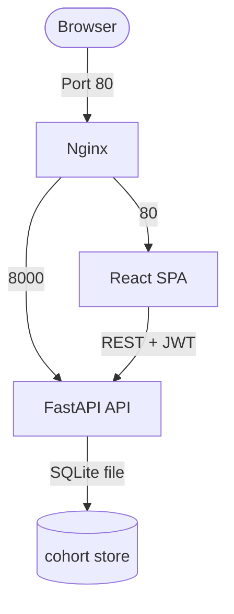

# Deployment Guide: RetainIQ

Hosting, environment variables, Docker Compose, and production (Render + Vercel).

---

## Database (SQLite — default)

RetainIQ uses a **SQLite file** by default to persist:

- Upload metadata
- Scored **subscriber rows** (Telco schema cohort data)
- Predictions, SHAP drivers, and save plays

```env
DATABASE_URL=sqlite:///./customer_retention.db
```

**Local file:** `backend/customer_retention.db` (gitignored)

**Docker:** volume `retainiq_sqlite` mounted at `/app/backend/data/`

### Optional: PostgreSQL

Set `DATABASE_URL=postgresql://...` (or Render’s `postgres://...` string) if you want persistent storage across redeploys. No code changes required — only the connection string.

---

## Production (Render + Vercel)

Split deploy used for the live portfolio demo:

| Service | Platform | Role |
|---------|----------|------|
| Frontend | **Vercel** (`frontend/`) | React static build |
| Backend | **Render** (Docker `backend/Dockerfile`) | FastAPI + ML |

**Vercel** — root directory `frontend`, build `npm run build`, output `dist`:

```env
VITE_API_BASE_URL=https://YOUR-SERVICE.onrender.com
```

Use **Config** (not Secret) for `VITE_*` variables.

**Render** — Dockerfile path `backend/Dockerfile`, health check `/health`:

```env
APP_ENV=production
JWT_SECRET=<secure-random>
ADMIN_PASSWORD_HASH=<bcrypt-hash>
ALLOW_USER_REGISTRATION=true
ALLOWED_ORIGINS=https://YOUR-APP.vercel.app,http://localhost:5173
DATABASE_URL=sqlite:///./data/customer_retention.db
```

**SQLite on Render (default):** No extra services needed. Data lives in the container filesystem and may be **reset on redeploy** on the free tier — fine for a portfolio demo (re-upload the Telco CSV after a deploy).

**Optional PostgreSQL:** If you need data to survive redeploys, add a free Postgres instance on Render, set `DATABASE_URL` to its connection string, and redeploy. The Docker entrypoint runs `alembic upgrade head` on boot. The app already supports `postgresql://` and `postgres://` URLs.

See `render.yaml` in the repo root for a Blueprint reference.

Keep the backend awake on Render free tier with an external ping to `/health` (e.g. UptimeRobot, 5 min interval).

---

## Docker Compose topology


```mermaid
graph TD
    User([Browser]) -->|Port 80| Proxy[Nginx]
    Proxy -->|80| React[React SPA]
    Proxy -->|8000| FastAPI[FastAPI API]
    React -->|REST + JWT| FastAPI
    FastAPI -->|SQLite file| DB[(cohort store)]
```

Services: **backend**, **frontend**, **nginx** — no separate database container.

---

## 2. Docker Compose

From the `docker/` folder (loads repo root `.env`):

```bash
docker compose --env-file ../.env up --build
```

Key environment variables (see root `.env.example`):

| Variable | Default |
|----------|---------|
| `DATABASE_URL` | `sqlite:///./data/customer_retention.db` |
| `ALLOW_USER_REGISTRATION` | `false` |
| `APP_ENV` | `development` |

**Default login** (development): `admin` / `password`

---

## 3. Environment Variables Specification

Customize application behavior at startup by supplying the following variables:

### Backend Application Environment
| Variable Name | Type | Default Value | Description |
| :--- | :---: | :--- | :--- |
| `APP_ENV` | String | `development` | Deployment environment mode (`development`, `production`). |
| `DEBUG` | Boolean | `True` | Enables debug log output and verbose traceback responses. |
| `DATABASE_URL` | String | `sqlite:///./customer_retention.db` | Connection URI. Defaults to local SQLite if unset. |
| `ALLOWED_ORIGINS` | String | `http://localhost:5173,http://127.0.0.1:5173` | Comma-separated list of allowed CORS domains. |
| `JWT_SECRET` | String | (Default string) | HMAC-SHA256 signing secret. **Mandatory override in production**; server will refuse to start if default is used. |
| `ACCESS_TOKEN_EXPIRE_MINUTES` | Integer | `60` | Lifecycle duration of user auth sessions. |

### Frontend build (Vite)

Set at **image build time** via `docker/frontend.Dockerfile`:

| Variable | Default | Description |
| :--- | :--- | :--- |
| `VITE_API_BASE_URL` | *(empty)* | API root for browser `fetch`. Empty = same-origin `/api` through nginx. Set in repo root `.env` for direct API URL. |

---

## 4. Database Migrations (Alembic)

The codebase utilizes Alembic for tracking structural database changes.

To initialize or upgrade your production database schema:
```bash
# Run from the 'backend' folder
alembic upgrade head
```

If deploying inside Docker, run the migration inside the running backend container:
```bash
docker exec -it retainiq-backend alembic upgrade head
```

---

## 5. Reverse Proxy Configuration

The React SPA is static files served by nginx in the `frontend` container. The root `nginx` service proxies `/` to `frontend:80` and `/api/` to `backend:8000`.

See `docker/nginx.conf` and `docker/frontend.nginx.conf`.

---

## 6. Security & Rate Limiting

To protect public endpoints, the backend uses a sliding-window rate limiter.
- **Upload & Explain Route Limit**: 60 requests per minute per client key (token or IP).
- **Auth Login Route Limit**: 10 requests per minute per client key (prevents brute-force credential attacks).
- **Target Paths**: `/api/v1/auth/login`, `/api/v1/upload`, `/api/v1/customers/{customer_id}/explain`.
- **Status Response**: Returns `429 Too Many Requests` with a JSON payload: `{"detail": "Too many requests. Please try again later."}`.
- **Stale Key Eviction**: The in-memory rate limiter database is pruned every 500 requests to prevent memory growth.

---

## 7. ML Artifact Retraining & CI/CD Pipeline

The platform implements a strict SHA-256 integrity verification system. If model artifacts are regenerated, `artifacts_manifest.json` must be updated, otherwise the application server will refuse to start.

### Retraining workflow

Run from the project root (see **README.md** — Machine Learning Pipeline Execution):

```bash
python ml/preprocessing/clean.py
python ml/preprocessing/pipeline.py
python ml/segmentation/train_autoencoder.py
python ml/segmentation/kmeans.py
python ml/training/ensemble.py
python ml/training/threshold.py
python ml/training/confusion_matrix.py
python ml/training/calibration.py
python ml/explainability/shap_global.py
python scripts/generate_manifest.py
```

Production classifier: `ml/artifacts/models/ensemble_model.pkl` (not `model.pkl`).

### GitHub Actions CI/CD Skeleton
```yaml
name: Weekly Model Retrain & Deploy

on:
  workflow_dispatch:           # Manual trigger
  schedule:
    - cron: "0 2 * * 0"        # Weekly retraining on Sunday at 2 AM

jobs:
  retrain:
    runs-on: ubuntu-latest
    steps:
      - uses: actions/checkout@v4
      - name: Install dependencies
        run: pip install -r backend/requirements-dev.txt
      - name: Run training pipeline & signatures
        run: make retrain
      - name: Run test suite
        run: pytest tests/ -v
      - name: Build & push Docker image
        run: |
          docker build -t retainiq-backend:latest -f backend/Dockerfile .
          docker push ghcr.io/${{ github.repository }}/retainiq-backend:latest
      - name: Deploy to Production
        run: ssh deploy@prod "cd /opt/retainiq/docker && docker-compose pull && docker-compose up -d"
```

---

## 8. Execution Commands

To build and start the platform services locally or on a server:

```bash
# Set required environment secrets (or populate a .env file)
export JWT_SECRET="$(openssl rand -hex 32)"
export POSTGRES_PASSWORD="$(openssl rand -hex 16)"

# Navigate to the docker orchestration folder
cd docker

# Build and startup all services in the background
docker compose --env-file ../.env up --build -d

# Check startup logs and health status
docker-compose logs -f

# Run database schema migrations
docker exec -it retainiq-backend alembic upgrade head

# Shutdown services and clean up network resources
docker-compose down
```
