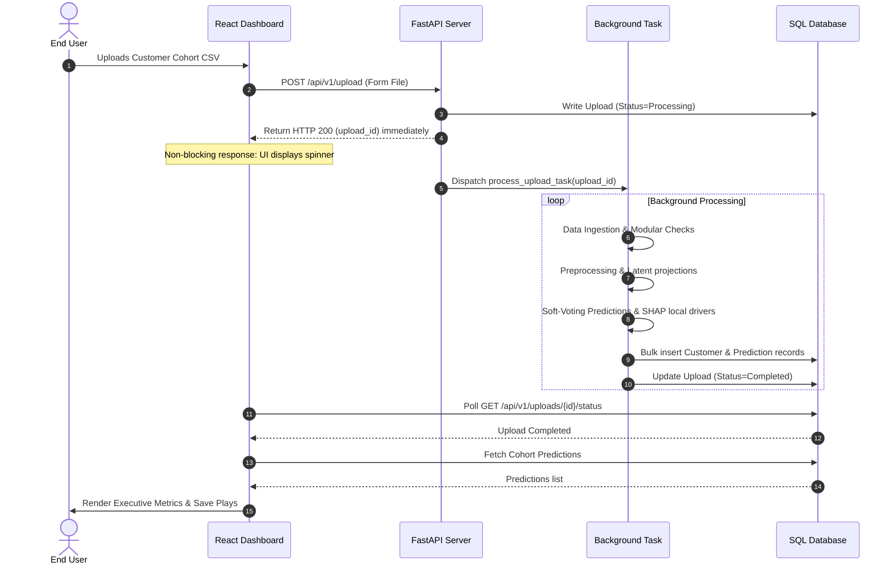
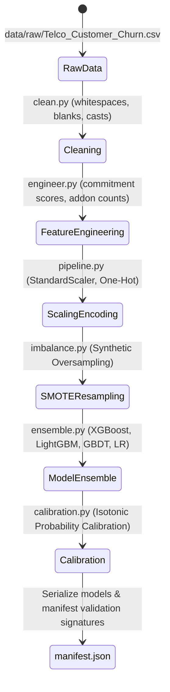
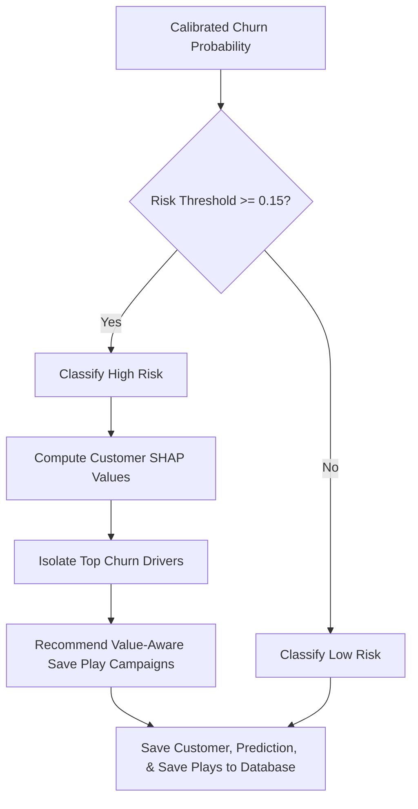
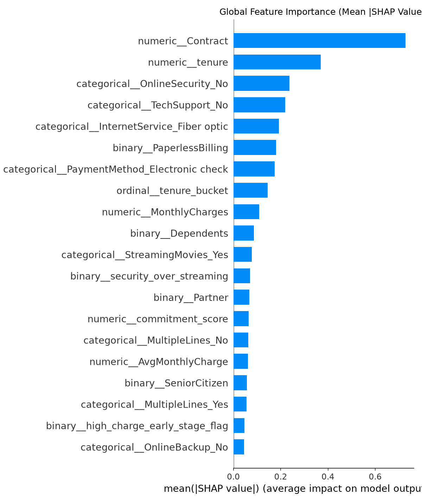
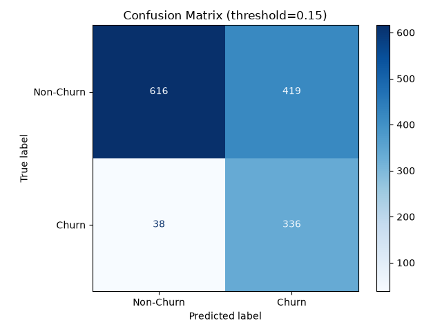

# RetainIQ — AI-Powered Customer Retention Intelligence Platform

[](https://www.python.org/)
[](https://fastapi.tiangolo.com/)
[](https://react.dev/)
[](https://vitejs.dev/)
[](docs/LOCAL_SETUP.md)
[](https://docs.pytest.org/)
[](https://www.docker.com/)

RetainIQ is a modular, end-to-end machine learning platform built to predict, analyze, and mitigate **telecom subscriber churn**. It uses models trained on the IBM Telco Churn schema and translates risk signals into actionable "Save Plays" to protect Monthly Recurring Revenue (MRR).

> **Default setup:** SQLite + single `admin` login. Public sign-up disabled unless configured. See **[docs/LOCAL_SETUP.md](docs/LOCAL_SETUP.md)**.

---

## 📐 System Architecture & Data Flow

### 1. High-Level Component Topology
```mermaid
graph TD
    User([Browser / Client]) -->|HTTP Port 80 / 443| Nginx[Nginx Reverse Proxy]
    Nginx -->|Port 80| React[React SPA (static)]
    Nginx -->|Port 8000| FastAPI[FastAPI Backend Service]
    React -->|REST Requests & Auth| FastAPI
    FastAPI -->|Async Tasks Queue| Worker[Threadpool / Background Workers]
    FastAPI -->|Read-Write Queries| DB[(SQLite — cohort store)]
```

### 2. Asynchronous Cohort Ingestion Lifecycle

```mermaid
sequenceDiagram
    autonumber
    actor Developer as End User
    participant UI as React Dashboard
    participant API as FastAPI Server
    participant Worker as Background Task
    participant DB as SQL Database

    Developer->>UI: Uploads Customer Cohort CSV
    UI->>API: POST /api/v1/upload (Form File)
    API->>DB: Write Upload (Status=Processing)
    API-->>UI: Return HTTP 200 (upload_id) immediately
    Note over UI: Non-blocking response: UI displays spinner
    API->>Worker: Dispatch process_upload_task(upload_id)
    loop Background Processing
        Worker->>Worker: Data Ingestion & Modular Checks
        Worker->>Worker: Preprocessing & Latent projections
        Worker->>Worker: Soft-Voting Predictions & SHAP local drivers
        Worker->>DB: Bulk insert Customer & Prediction records
        Worker->>DB: Update Upload (Status=Completed)
    end
    UI->>DB: Poll GET /api/v1/uploads/{id}/status
    DB-->>UI: Upload Completed
    UI->>DB: Fetch Cohort Predictions
    DB-->>UI: Predictions list
    UI->>Developer: Render Executive Metrics & Save Plays
```

### 3. Machine Learning Preprocessing & Training Pipeline

```mermaid
stateDiagram-v2
    [*] --> RawData: data/raw/Telco_Customer_Churn.csv
    RawData --> Cleaning: clean.py (whitespaces, blanks, casts)
    Cleaning --> FeatureEngineering: engineer.py (commitment scores, addon counts)
    FeatureEngineering --> ScalingEncoding: pipeline.py (StandardScaler, One-Hot)
    ScalingEncoding --> SMOTEResampling: imbalance.py (Synthetic Oversampling)
    SMOTEResampling --> ModelEnsemble: ensemble.py (XGBoost, LightGBM, GBDT, LR)
    ModelEnsemble --> Calibration: calibration.py (Isotonic Probability Calibration)
    Calibration --> manifest.json: Serialize models & manifest validation signatures
```

### 4. Local Explainer & Save Plays Decision Flow

```mermaid
graph TD
    CalibratedProb[Calibrated Churn Probability] --> RiskClassification{Risk Threshold >= 0.15?}
    RiskClassification -->|Yes| HighRisk[Classify High Risk]
    RiskClassification -->|No| LowRisk[Classify Low Risk]
    
    HighRisk --> SHAPExplainer[Compute Customer SHAP Values]
    SHAPExplainer --> IsolateDrivers[Isolate Top Churn Drivers]
    IsolateDrivers --> MapPlays[Recommend Value-Aware Save Play Campaigns]
    
    MapPlays --> Database[Save Customer, Prediction, & Save Plays to Database]
    LowRisk --> Database
```

---

## ⚡ Key Feature Matrix

| Feature | Capabilities | Emojis |
| :--- | :--- | :---: |
| **Real-Time Inference API** | Dynamic single-customer risk scoring, classification, and segment mapping. | 🧠 |
| **Explainable AI (XAI)** | Core Local SHAP explanation engines isolating primary positive/negative churn forces. | 🔍 |
| **Asynchronous Ingestion** | Bulk drag-and-drop CSV processing using concurrency-safe threadpool workers. | ⚡ |
| **Prescriptive Save Plays** | Value-aware customer retention campaign suggestions mapped to unique risk profiles. | 🛡️ |
| **Executive Dashboard** | Real-time analytics, revenue risk trackers, segment cohorts, and cohort trends. | 📊 |
| **Data Telemetry & Drift** | Real-time telemetry monitoring input distribution shifts using Kolmogorov-Smirnov checks. | 📈 |

---

## 📂 Repository Structure

```text
ai-customer-retention-platform/
├── backend/                  # FastAPI Web Server Tier
│   ├── app/
│   │   ├── api/              # Routers, authentication hooks, and rate limiters
│   │   ├── core/             # Configuration managers, logging, and security
│   │   ├── database/         # SQLAlchemy ORM schemas and Alembic configurations
│   │   └── services/         # Core business logic (Inference, DB persistence, Ingestion)
│   └── tests/                # Pytest unit and integration test suite
├── frontend/                 # React + Vite SPA
│   ├── src/                  # pages, components, lib (API client), assets
│   ├── package.json
│   └── vite.config.ts
├── ml/                       # Machine Learning Engineering Tier
│   ├── notebooks/            # Exploratory Data Analysis and modeling sandboxes
│   ├── preprocessing/        # Pandas ETL, cleaning, engineering, and validators
│   ├── training/             # Ensemble fitters, calibrations, and metrics validations
│   └── artifacts/            # Serialized models, scalers, and metric assets
│       ├── artifacts_manifest.json  # Checksum validation signatures
│       ├── model.pkl         # Serialized Calibrated GBDT Ensemble
│       ├── pipeline.pkl      # Preprocessing ColumnTransformer
│       ├── encoders.pkl      # Categorical dictionaries map
│       └── model_metadata.pkl # Model training inputs and expected features list
├── configs/                  # Global YAML settings, features, and model constants
├── docker/                   # Nginx reverse proxy configs and docker compose files
│   ├── docker-compose.yml
│   ├── frontend.Dockerfile   # React build + nginx static server
│   └── nginx.conf
└── data/                     # Ignored directory hosting raw and clean datasets
```

---

## 📊 Model Performance & Business Savings

By deploying the cost-sensitive decision theory model threshold sweep at `0.15` (balancing the asymmetric $5.0 cost of a False Churn Miss against the $1.0 cost of an Outreach Campaign), RetainIQ delivers a **67.4% reduction in churn-associated losses**:

> [!NOTE]
> **Imbalance Mitigation (SMOTE):** To address the dataset's class imbalance (~26.5% churn baseline), all models are trained on features oversampled via **SMOTE (Synthetic Minority Over-sampling Technique)** to a balanced 50/50 ratio. Evaluations are performed strictly on the natural, un-resampled holdout test set to maintain real-world validation integrity.

### 1. Cost Optimization & Business Impact (Holdout Test Set)

| Metric | No Outreach (Baseline) | Standard Threshold (`0.528`) | Cost-Optimal Threshold (`0.15`) |
| :--- | :---: | :---: | :---: |
| **Recall (Churners Caught)** | 0.0% | 48.9% | **89.8%** (Catches ~90%) |
| **Operational Accuracy** | 73.5% | **80.0%** | 67.6% |
| **Total Churn Cost** | $1,870.0 | $1,046.0 | **$609.0** |
| **Net Financial Savings** | $0.0 | $824.0 | **$1,261.0** (**67.4% cost reduction**) |

### 2. Algorithm Performance Benchmarks

| Model Family | Operational Threshold | Holdout Accuracy | Holdout ROC-AUC | Holdout F1-Score |
| :--- | :---: | :---: | :---: | :---: |
| **Calibrated Ensemble (GBDT)** | `0.15` | 67.6% | **84.4%** | **0.595** (High Recall focus) |
| **Logistic Regression** | `0.528` | 75.7% | 84.4% | 0.624 |
| **AdaBoost** | `0.50` | 77.9% | 84.0% | 0.634 |
| **Gradient Boosting** | `0.528` | 78.5% | 84.2% | 0.607 |
| **XGBoost** | `0.528` | 78.6% | 82.5% | 0.584 |
| **LightGBM** | `0.528` | 78.7% | 83.3% | 0.576 |
| **Random Forest** | `0.528` | 77.4% | 81.2% | 0.545 |

---

### 3. Understanding the Benchmarks & Operating Points

#### Why are there different decision thresholds?
* **F1-Optimal Threshold (`0.528` / `0.50`):** This represents the default standard threshold optimized to maximize mathematical classification metrics (balancing Precision and Recall equally). While this yields a higher raw accuracy (~80%), it misses nearly half of the churners (Recall is only ~48.9%).
* **Cost-Optimal Threshold (`0.15`):** Lowered threshold used exclusively on our calibrated model. By utilizing **Isotonic Probability Calibration**, we map raw scores to true probability estimates, enabling the cost-optimal decision boundary (`0.15`). This prioritizes catching churners (**Recall ~89.8%**) to minimize overall business losses (since a missed churner is 5x more costly than a false-positive campaign outreach).

#### What is the impact of SMOTE resampling?
Oversampling the minority churn class with SMOTE before training provides a consistent metric lift across the standard classification baseline. Below is the comparative validation of our GBDT Ensemble model on the natural holdout test set with and without SMOTE applied:

| Configuration | Threshold | Accuracy | Precision | Recall | F1-Score | ROC-AUC |
| :--- | :---: | :---: | :---: | :---: | :---: | :---: |
| **With SMOTE (Production)** | `0.15` (Cost-Optimal) | 67.6% | 44.5% | **89.8%** | 0.595 | 84.0% |
| **Without SMOTE (Baseline)** | `0.15` (Cost-Optimal) | 69.1% | 45.7% | 88.2% | 0.602 | 84.1% |
| | | | | | | |
| **With SMOTE (Production)** | `0.50` (Standard) | **80.1%** | **65.6%** | **52.9%** | **0.586** | 84.0% |
| **Without SMOTE (Baseline)** | `0.50` (Standard) | 79.7% | 64.7% | 51.9% | 0.576 | 84.1% |

* **At Standard Threshold (`0.50`):** SMOTE increases all metrics simultaneously, yielding a **+1.0% Recall** boost and a **+1.0% F1-Score** boost.
* **At Cost-Optimal Threshold (`0.15`):** SMOTE drives a **+1.6% Recall** improvement (catching more churners), which translates directly to greater revenue protection and net business savings.

---

## 🖼️ Model Evaluation Plots & Visualizations

The generated evaluation metrics are serialized inside the `ml/artifacts/plots/` directory:

* **Global Feature Importance (SHAP)**: Summarizes the top drivers (like contract type, monthly charges, and fiber optic subscriptions) pushing customers towards churn.
  
  
* **Probability Reliability Curve**: Visualizes model confidence calibration against actual frequencies.
  
  
* **Cost Optimization Sweep**: Plots total business costs across probability thresholds to identify the absolute savings minimum at `0.15`.
  
  
* **Holdout Confusion Matrix**: Captures model counts at the active operational threshold.
  

---

## 🚀 Local Quick-Start Guide

### Prerequisites
* **Python 3.10+** installed.
* **Git** installed.

### 1. Initialize virtual environment and install packages
Run the setup script from the project root directory. This script will automatically create a virtual environment, upgrade pip, and install all required packages:
```bash
# On Linux / macOS / Git Bash
./scripts/setup.sh
```

### 2. Configure Environment Variables
Copy `.env.example` to `.env` in the **project root** (one file for backend, frontend, and Docker).

**Default login** (`APP_ENV=development`, default dev hash):
- Username: `admin`
- Password: `password`

Set `ALLOW_USER_REGISTRATION=false` (default) for a single admin account.

```env
APP_NAME="RetainIQ API"
JWT_SECRET="your-secure-random-token-here"
ALLOW_USER_REGISTRATION=false
DATABASE_URL="sqlite:///./customer_retention.db"
```

### ⚙️ Environment Configuration Schema

| Variable | Description | Default | Requirements |
| :--- | :--- | :---: | :---: |
| `DATABASE_URL` | SQLAlchemy connection string (SQLite default) | `sqlite:///./customer_retention.db` | Required |
| `ALLOW_USER_REGISTRATION` | Public sign-up endpoint | `false` | Recommended |
| `JWT_SECRET` | Secret key used to sign client credentials tokens | *None* | Required |
| `APP_NAME` | Global application name match for pytest checks | `"RetainIQ API"` | Required |
| `DEBUG` | Enables verbose console printing | `False` | Optional |
| `LOG_LEVEL` | Logging filtering threshold (INFO, DEBUG, WARNING) | `INFO` | Optional |

### 3. Run Database Migrations
Initialize your local database schemas using Alembic migrations:
```bash
cd backend
# Activate virtual environment
source ../venv/Scripts/activate # Windows Git Bash
# source ../venv/bin/activate   # Linux/macOS

# Apply migrations
alembic upgrade head
```

### 4. Boot Up the Applications

#### Launch the FastAPI API Server:
```bash
# Inside the backend/ directory
uvicorn app.main:app --reload
```
* **API Documentation (Swagger)**: Open [http://localhost:8000/docs](http://localhost:8000/docs)
* **API Redoc**: Open [http://localhost:8000/redoc](http://localhost:8000/redoc)

#### Launch the React UI:
```bash
# From repo root — ensure .env exists (cp .env.example .env)
cd frontend
npm install
npm run dev
```
* **UI Interface**: Open [http://localhost:5173](http://localhost:5173)

---

## ⚡ Machine Learning Pipeline Execution

Developers can trigger preprocessing pipelines, hyperparameter tuning, segmentation model retraining, and statistics validations using these commands from the project root:

* **Ingestion ETL & Pipelines**: Re-run cleaning, feature scaling, SMOTE balance, and exports `pipeline.pkl`:
  ```bash
  python ml/preprocessing/pipeline.py
  ```
* **Autoencoder Training**: Retrains PyTorch compression networks to reduce continuous dimensions down to 16:
  ```bash
  python ml/segmentation/train_autoencoder.py
  ```
* **K-Means Clustering**: Clusters latent customer coordinates into risk cohorts and exports `kmeans_personas.md`:
  ```bash
  python ml/segmentation/kmeans.py
  ```
* **Calibrated Ensemble Retraining**: Fits XGBoost, LightGBM, GBDT, and Logistic Regression models and exports `model_ensemble.pkl`:
  ```bash
  python ml/training/ensemble.py
  ```
* **Cost Sweeps & Decision Threshold**: sweep probability threshold against False Negative/False Positive ratios:
  ```bash
  python ml/training/threshold.py
  ```
* **Inference Telemetry Drift**: Evaluates statistical drift on production logs database tables:
  ```bash
  python ml/training/model_monitor.py
  ```

---

## 🔌 API Endpoints Reference

| Method | Endpoint | Description | Auth Required | Rate Limit |
| :--- | :--- | :--- | :---: | :---: |
| `POST` | `/api/v1/auth/register` | User account registration | No | — |
| `POST` | `/api/v1/auth/login` | Credentials token generation (OAuth2) | No | 10 / min |
| `POST` | `/api/v1/upload` | Cohort CSV dataset async ingestion | Yes | 60 / min |
| `GET` | `/api/v1/uploads` | Ingestion status listing | Yes | — |
| `GET` | `/api/v1/customers` | Query paginated customer lists | Yes | — |
| `GET` | `/api/v1/customers/{id}/explain` | Compute local customer SHAP Save Plays | Yes | 60 / min |
| `GET` | `/api/v1/analytics/drift` | Get Kolmogorov-Smirnov feature drift statistics | Yes | — |
| `GET` | `/health` | In-memory server health check status | No | — |

---

## 🧪 Testing and Coverage Commands

Run the full testing framework locally to ensure system stability across endpoints and ML structures:
```bash
# From the project root folder
python -m pytest
```
* **Database Verification**: Asserts database engine cascades, `is_high_risk` constraints, and table relations.
* **API Validation**: Simulates Latin-1/UTF-8 file uploads, token validations, and endpoint authentication.
* **Calibration Verification**: Ensures Expected Calibration Error (ECE) calculations evaluate correctly.

---

## 🛡️ Telemetry, Security & Guardrails

* **Logging Filter (Redaction)**:
  An active regex-filter (`app/core/logging_config.py`) checks stdout streams and replaces credentials, charges, or user metrics with `[REDACTED]` to prevent printing sensitive information in logs.
* **Cryptography Integrity**:
  During server boot, the application reads the SHA-256 hashes of `pipeline.pkl`, `model.pkl`, `encoders.pkl`, and `model_metadata.pkl` inside `artifacts_manifest.json`. If a mismatch is detected, startup aborts with an `ArtifactValidationError` to prevent loading corrupted model files.
* **Thread-Safe Memory Sweepers**:
  API requests eviction loops clear old timestamps periodically (every 500 requests) inside the sliding-window rate-limiting middleware to prevent memory growth leaks in production.
* **SQLite (default)**:
  Local SQLite file stores uploaded subscriber cohorts and scores. Upload processing runs in a background worker to reduce write contention. See **[docs/LOCAL_SETUP.md](docs/LOCAL_SETUP.md)**.
* **Relational Database Cascades**:
  The persistence schema utilizes strict SQL relational cascades. Deleting any `Upload` record automatically cascades and purges all dependent customer profiles and prediction logs, maintaining DB integrity and clean storage.

---

## 🌍 Enterprise Hosting & Cloud Deployment

For Docker Compose and optional cloud hosting, see **[DEPLOYMENT.md](DEPLOYMENT.md)** and **[docs/LOCAL_SETUP.md](docs/LOCAL_SETUP.md)**.

---

## 📄 License
Distributed under the MIT License. See [LICENSE](LICENSE) for more details.