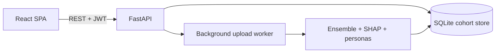
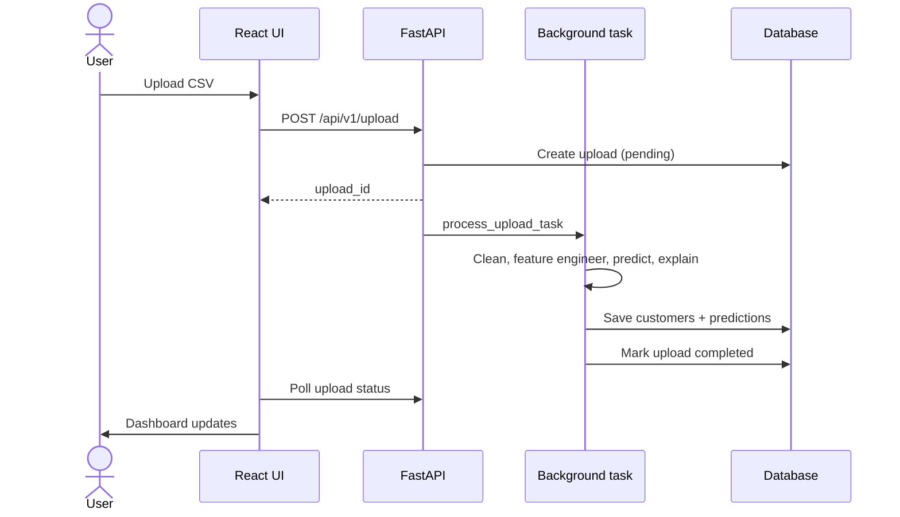
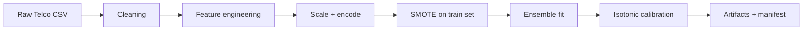
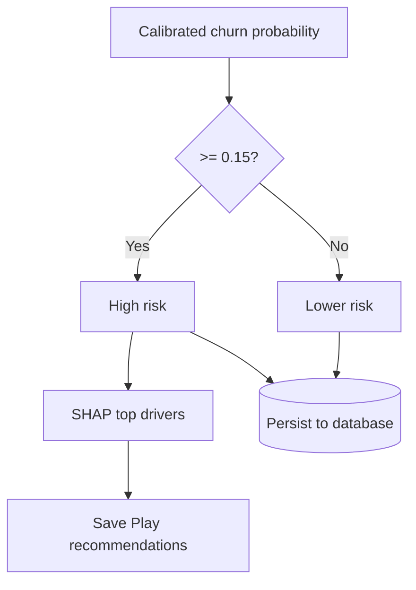

# RetainIQ

**AI-powered customer retention platform for telecom subscribers.**

RetainIQ predicts who is likely to churn, explains why with SHAP, and suggests concrete retention actions — so teams can protect monthly recurring revenue instead of reacting after customers leave.

[](https://www.python.org/)
[](https://fastapi.tiangolo.com/)
[](https://react.dev/)
[](https://docs.pytest.org/)

---

## Why this exists

Telecom churn is expensive. A retention team needs three answers, not one score:

1. **Who** is at risk?
2. **Why** are they likely to leave?
3. **What** should we do about it?

RetainIQ is built around that workflow. It uses the IBM Telco Customer Churn schema, trains an ensemble model on historical data, and turns predictions into a web application that analysts and managers can actually use.

---

## What it does

End to end, the product flow looks like this:

```
Sign in → Upload cohort CSV → Background scoring → Dashboard & at-risk list → Subscriber detail (SHAP + Save Plays) → Reports & what-if
```

| Area | What you get |
|------|----------------|
| **Cohort upload** | Drag-and-drop Telco-format CSV; processing runs in the background so the UI stays responsive |
| **Dashboard** | Total subscribers, average churn risk, revenue at risk, risk bands, trends |
| **At-risk view** | Filterable, sortable list of high-risk subscribers |
| **Subscriber detail** | Churn probability, top SHAP drivers, recommended Save Plays, counterfactual simulations |
| **Analytics** | Personas (K-Means segments), segment matrix, global drivers, model diagnostics |
| **What-if** | Edit contract, tenure, or charges and see how risk changes |
| **Single-customer scoring** | Score one subscriber from form inputs without a full upload |
| **Executive reports** | Export-friendly summaries for stakeholders |

Sample dataset: [`data/raw/Telco_Customer_Churn.csv`](data/raw/Telco_Customer_Churn.csv)

---

## How it is built

### Application architecture


```mermaid
graph LR
    Browser[React SPA] -->|REST + JWT| API[FastAPI]
    API --> Worker[Background upload worker]
    API --> DB[(SQLite cohort store)]
    Worker --> ML[Ensemble + SHAP + personas]
    ML --> DB
```

- **Frontend:** React 19, Vite 7, Tailwind, Recharts, Plotly
- **Backend:** FastAPI, SQLAlchemy, Alembic, JWT auth (email sign-up in production)
- **Database:** SQLite by default (`DATABASE_URL`); PostgreSQL supported via connection string
- **ML:** scikit-learn ensemble (XGBoost, LightGBM, GBDT, Logistic Regression), isotonic calibration, local SHAP, K-Means personas
- **Deploy:** Vercel (frontend) + Render (Docker backend); optional Docker Compose locally with nginx

Each user only sees their own uploads and scored cohorts. On boot, the API verifies ML artifact SHA-256 hashes from `ml/artifacts/artifacts_manifest.json` and refuses to start if files are missing or tampered with.

### Upload lifecycle


```mermaid
sequenceDiagram
    actor User
    participant UI as React UI
    participant API as FastAPI
    participant Worker as Background task
    participant DB as Database

    User->>UI: Upload CSV
    UI->>API: POST /api/v1/upload
    API->>DB: Create upload (pending)
    API-->>UI: upload_id
    API->>Worker: process_upload_task
    Worker->>Worker: Clean, feature engineer, predict, explain
    Worker->>DB: Save customers + predictions
    Worker->>DB: Mark upload completed
    UI->>API: Poll upload status
    UI->>User: Dashboard updates
```

### Machine learning pipeline


```mermaid
flowchart LR
    A[Raw Telco CSV] --> B[Cleaning]
    B --> C[Feature engineering]
    C --> D[Scale + encode]
    D --> E[SMOTE on train set]
    E --> F[Ensemble fit]
    F --> G[Isotonic calibration]
    G --> H[Artifacts + manifest]
```

| Step | Module | Purpose |
|------|--------|---------|
| Cleaning | `ml/preprocessing/clean.py` | Whitespace, blanks, type casts |
| Features | `ml/preprocessing/engineer.py` | Commitment scores, add-on counts, tenure bins |
| Pipeline | `ml/preprocessing/pipeline.py` | `StandardScaler`, one-hot encoding |
| Imbalance | `ml/preprocessing/imbalance.py` | SMOTE on training data only |
| Training | `ml/training/ensemble.py` | Soft-voting ensemble |
| Calibration | `ml/training/calibration.py` | Reliable probability estimates |
| Explainability | `ml/explainability/shap_local.py` | Per-subscriber drivers and simulations |
| Segmentation | `ml/segmentation/kmeans.py` | Behavioral personas |

Training uses **SMOTE** on the training split (~26.5% churn baseline in the dataset). All reported metrics come from the **natural, un-resampled holdout test set**.

### From probability to action


```mermaid
flowchart TD
    P[Calibrated churn probability] --> T{>= 0.15?}
    T -->|Yes| HR[High risk]
    T -->|No| LR[Lower risk]
    HR --> SHAP[SHAP top drivers]
    SHAP --> SP[Save Play recommendations]
    HR --> DB[(Persist to database)]
    LR --> DB
```

The production decision threshold is **0.15**, chosen by cost-sensitive analysis: a missed churner costs **$5**, a false-positive outreach costs **$1**. Catching more true churners matters more than maximizing raw accuracy.

Deeper feature notes: **[docs/feature_engineering.md](docs/feature_engineering.md)**

---

## Results

### Business impact (holdout test set)

| Metric | No outreach | Standard threshold (0.528) | Cost-optimal threshold (0.15) |
|--------|:-----------:|:--------------------------:|:-----------------------------:|
| Recall (churners caught) | 0.0% | 48.9% | **89.8%** |
| Accuracy | 73.5% | **80.0%** | 67.6% |
| Total churn cost | $1,870 | $1,046 | **$609** |
| Net savings vs baseline | $0 | $824 | **$1,261 (67.4% reduction)** |

### Model benchmarks (holdout)

| Model | Threshold | Accuracy | ROC-AUC | F1 |
|-------|:---------:|:--------:|:-------:|:--:|
| **Calibrated ensemble (production)** | 0.15 | 67.6% | **84.4%** | **0.595** |
| Logistic regression | 0.528 | 75.7% | 84.4% | 0.624 |
| AdaBoost | 0.50 | 77.9% | 84.0% | 0.634 |
| Gradient boosting | 0.528 | 78.5% | 84.2% | 0.607 |
| XGBoost | 0.528 | 78.6% | 82.5% | 0.584 |
| LightGBM | 0.528 | 78.7% | 83.3% | 0.576 |
| Random forest | 0.528 | 77.4% | 81.2% | 0.545 |

**Why two thresholds?**

- **0.528 / 0.50 (F1-optimal):** Balances precision and recall; higher accuracy (~80%) but catches only ~49% of churners.
- **0.15 (cost-optimal):** Used in production after isotonic calibration. Lower accuracy on paper, but **~90% recall** and much lower total churn cost when outreach is cheaper than losing a customer.

### SMOTE comparison (ensemble, holdout)

| Configuration | Threshold | Accuracy | Precision | Recall | F1 | ROC-AUC |
|---------------|:---------:|:--------:|:---------:|:------:|:--:|:-------:|
| With SMOTE (production) | 0.15 | 67.6% | 44.5% | **89.8%** | 0.595 | 84.0% |
| Without SMOTE | 0.15 | 69.1% | 45.7% | 88.2% | 0.602 | 84.1% |
| With SMOTE (production) | 0.50 | **80.1%** | **65.6%** | 52.9% | 0.586 | 84.0% |
| Without SMOTE | 0.50 | 79.7% | 64.7% | 51.9% | 0.576 | 84.1% |

At 0.15, SMOTE adds **+1.6% recall** — more churners caught, which maps directly to revenue protection.

### Evaluation plots

Artifacts live in `ml/artifacts/plots/`:

| Plot | What it shows |
|------|----------------|
| SHAP summary | Global feature importance (contract, charges, fiber, etc.) |
| Calibration curve | Predicted vs actual churn rates |
| Threshold sweep | Business cost by probability cutoff; minimum near 0.15 |
| Confusion matrix | Counts at the operational threshold |
| ROC / PR curves | Discrimination and precision–recall trade-offs |


---

## Live deployment

| Service | URL |
|---------|-----|
| **Web app** | https://retainiq-tan.vercel.app |
| **API health** | https://retainiq-api-zzu9.onrender.com/health |

Create an account with your email, upload a Telco-format CSV, then open **At-risk** or the **Dashboard**. OpenAPI docs (`/api/v1/docs`) are available when running the API locally; they are disabled in production for security.

Hosting details: **[DEPLOYMENT.md](DEPLOYMENT.md)**

---

## Quick start

**Prerequisites:** Python 3.10+, Node.js 20+, Git.

```bash
git clone https://github.com/krishankantjha/ai-customer-retention-platform.git
cd ai-customer-retention-platform
cp .env.example .env
./scripts/setup.sh          # optional: Python venv + dependencies
cd backend && alembic upgrade head && cd ..
```

**Backend** (from `backend/`):

```bash
uvicorn app.main:app --reload
```

**Frontend** (from `frontend/`):

```bash
npm install
npm run dev
```

| | URL |
|---|-----|
| UI | http://localhost:5173 |
| API docs | http://localhost:8000/docs |

Set `VITE_API_BASE_URL=http://127.0.0.1:8000` in the root `.env` for local development.

**Default login** when `APP_ENV=development`: `admin` / `password`  
Set `ALLOW_USER_REGISTRATION=true` to enable public sign-up (used on the live deployment).

**Docker Compose** (nginx + frontend + backend): see **[DEPLOYMENT.md](DEPLOYMENT.md)**.

### Environment variables

One `.env` at the repo root feeds backend, frontend, and Docker.

| Variable | Description | Default |
|----------|-------------|---------|
| `DATABASE_URL` | SQLAlchemy connection string | `sqlite:///./customer_retention.db` |
| `JWT_SECRET` | Signs auth tokens | Required in production |
| `ADMIN_PASSWORD_HASH` | Bcrypt hash for admin login | Required in production |
| `ALLOW_USER_REGISTRATION` | Public sign-up endpoint | `false` |
| `ALLOWED_ORIGINS` | CORS origins (comma-separated) | localhost dev URLs |
| `VITE_API_BASE_URL` | Frontend → API base URL | empty in dev (Vite proxy) |
| `APP_ENV` | `development` / `production` | `development` |
| `MAX_UPLOAD_SIZE_MB` | CSV upload size cap | `25` |

---

## Repository structure

```text
RetainIQ/
├── backend/                 # FastAPI API, auth, upload, analytics
│   ├── app/api/             # Route handlers
│   ├── app/services/        # Inference, ingestion, scoping
│   ├── app/database/        # SQLAlchemy models + Alembic
│   └── tests/               # API and integration tests
├── frontend/                # React + Vite SPA
├── ml/                      # Preprocessing, training, explainability
│   ├── preprocessing/
│   ├── training/
│   ├── explainability/
│   ├── segmentation/
│   └── artifacts/           # Models, encoders, plots, manifest
├── configs/                 # YAML model and feature config
├── docker/                  # docker-compose.yml, nginx
├── data/raw/                # Sample Telco CSV
├── tests/                   # Cross-cutting tests (ML, security)
├── DEPLOYMENT.md
└── docs/feature_engineering.md
```

---

## Retrain and ML commands

Run from the project root:

```bash
# Preprocessing pipeline → pipeline.pkl
python ml/preprocessing/pipeline.py

# K-Means personas → kmeans artifacts
python ml/segmentation/kmeans.py

# Ensemble training → ensemble model artifacts
python ml/training/ensemble.py

# Threshold / cost sweep
python ml/training/threshold.py

# Drift monitoring utilities
python ml/training/model_monitor.py

# Autoencoder (optional segmentation prep)
python ml/segmentation/train_autoencoder.py
```

After retraining, update `ml/artifacts/artifacts_manifest.json` checksums or let the training scripts regenerate them.

---

## API reference

Base path: `/api/v1`  
Auth: `Authorization: Bearer <token>` unless noted.

| Method | Endpoint | Description | Auth |
|--------|----------|-------------|:----:|
| `POST` | `/auth/register` | Create account | No |
| `POST` | `/auth/login` | Get JWT (OAuth2 form) | No |
| `GET` | `/auth/me` | Current user profile | Yes |
| `PATCH` | `/auth/me` | Update display name | Yes |
| `POST` | `/auth/change-password` | Change password | Yes |
| `POST` | `/upload` | Upload cohort CSV (async) | Yes |
| `GET` | `/uploads` | List recent uploads | Yes |
| `GET` | `/uploads/{id}/status` | Upload processing status | Yes |
| `GET` | `/customers/search` | Autocomplete customer IDs | Yes |
| `GET` | `/customers/{id}/explain` | SHAP + Save Plays + simulations | Yes |
| `POST` | `/predict/score` | Score single subscriber | Yes |
| `POST` | `/predict/simulate` | What-if probability | Yes |
| `GET` | `/analytics/overview` | Dashboard KPIs | Yes |
| `GET` | `/analytics/cohort-data` | Paginated cohort table | Yes |
| `GET` | `/analytics/personas` | Cluster summaries | Yes |
| `GET` | `/analytics/save-plays` | Campaign aggregates | Yes |
| `GET` | `/analytics/risk-trend` | Risk over time | Yes |
| `GET` | `/analytics/global-drivers` | Cohort SHAP summary | Yes |
| `GET` | `/analytics/segment-matrix` | Contract × tenure matrix | Yes |
| `GET` | `/analytics/model-health` | Drift and health metadata | Yes |
| `GET` | `/analytics/diagnostics-metadata` | Model version and checksums | Yes |
| `GET` | `/health` | Service health | No |

Rate limits apply on login, upload, and explain paths (see `app/core/rate_limiter.py`).

---

## Testing

```bash
python -m pytest
```

**109 tests** cover API flows, upload → predict → explain, auth, artifact integrity, risk bands, drift utilities, and per-user data isolation.

CI (GitHub Actions): Python tests + `compileall` + frontend production build.

---

## Security and reliability

| Topic | Implementation |
|-------|----------------|
| **Authentication** | JWT + bcrypt; token version bumps on password change |
| **Data isolation** | Uploads scoped per registered user; admin sees all |
| **Artifact integrity** | SHA-256 manifest check at startup; corrupt models block boot |
| **Rate limiting** | Sliding window on sensitive endpoints |
| **Log redaction** | Regex filter masks credentials and PII in logs |
| **CORS** | Configurable `ALLOWED_ORIGINS`; validated in production |
| **Production secrets** | `JWT_SECRET` and `ADMIN_PASSWORD_HASH` required when `APP_ENV=production` |
| **OpenAPI** | Disabled in production |
| **Upload processing** | Background worker; size limit via `MAX_UPLOAD_SIZE_MB` |
| **Cascading deletes** | Removing an upload deletes its customers and predictions |

---

## Documentation

| Document | Contents |
|----------|----------|
| [DEPLOYMENT.md](DEPLOYMENT.md) | Render, Vercel, Docker Compose, env vars |
| [docs/feature_engineering.md](docs/feature_engineering.md) | Feature design and rationale |
| [ml/artifacts/metrics/kmeans_personas.md](ml/artifacts/metrics/kmeans_personas.md) | Persona cluster definitions |

---

## License

MIT — see [LICENSE](LICENSE).
