# RetainIQ

**Full-stack churn analytics dashboard for IBM Telco subscriber data.**

RetainIQ is built on public IBM Telco sample data. Upload a CSV, view churn scores and SHAP explanations, and explore the results in a React dashboard. A hosted instance is available at the link below.

[](https://retainiq-tan.vercel.app)
[](https://www.python.org/)
[](https://fastapi.tiangolo.com/)
[](https://react.dev/)
[](https://docs.pytest.org/)
[](https://github.com/krishankantjha/RetainIQ/actions/workflows/ci.yml)
[](LICENSE)

---

## Contents

- [Why this exists](#why-this-exists)
- [What it does](#what-it-does)
- [UI tour](#ui-tour)
- [How it is built](#how-it-is-built)
- [Results](#results)
- [Live deployment](#live-deployment)
- [Quick start](#quick-start)
- [Sign in and accounts](#sign-in-and-accounts)
- [Environment variables](#environment-variables)
- [Repository structure](#repository-structure)
- [Retrain and ML commands](#retrain-and-ml-commands)
- [API reference](#api-reference)
- [Testing](#testing)
- [Security notes](#security-notes)
- [Known limitations](#known-limitations)
- [Documentation](#documentation)
- [Author](#author)
- [License](#license)

---

## Why this exists

RetainIQ is a churn analytics dashboard built around a practical retention workflow — scoring, explanation, and review in one interface.

The workflow:

1. **Who** looks at risk?
2. **Why** does the model think so? (SHAP)
3. **What** might you try? (rule-based save-play suggestions — display only)

It uses the IBM Telco Customer Churn schema, trains an ensemble on that dataset, and serves the output through a web UI you can run locally or on the hosted deployment.

Sample dataset: [`data/raw/Telco_Customer_Churn.csv`](data/raw/Telco_Customer_Churn.csv)  
Dataset source: [IBM Telco Customer Churn on Kaggle](https://www.kaggle.com/datasets/blastchar/telco-customer-churn). RetainIQ does not own this data. It is included for training and evaluation only.

---

## What it does

Typical path through the dashboard:

```
Sign in → Upload cohort CSV → Background scoring → Dashboard & at-risk list → Subscriber detail (SHAP + interventions) → Reports & what-if
```

These are the main pages in the app (same names as the sidebar):

| Page | What you get |
|------|----------------|
| **Dashboard** | Total subscribers, average churn risk, estimated revenue at risk, risk bands |
| **Reports** | Summary view for the cohort; download as PDF or CSV |
| **At-risk subscribers** | Filterable, sortable list of high-risk accounts; export CSV |
| **Trends** | Personas (K-Means segments), segment matrix, global SHAP drivers |
| **Model diagnostics** | Holdout metrics, calibration plots, drift checks |
| **Interventions** | Save-play ideas grouped by type (suggestions only — not sent anywhere) |
| **What-if lab** | Change contract, tenure, or charges and see how risk shifts |
| **Data explorer** | Browse the full scored cohort in a table; export CSV |
| **Upload data** | Drag-and-drop Telco-format CSV; scoring runs in the background |
| **Score customer** | Score one subscriber from a form without uploading a file |
| **Subscriber detail** | Churn probability, SHAP drivers, interventions, counterfactuals |
| **Settings** | Update display name and change password |

Other UI bits worth knowing:

- **Global search** in the header — jump to a page or find a customer ID
- **Dark / light theme** on the login page
- **Guest login** — try the app without creating an account (when enabled)

---

## UI tour

Screenshots from the [live app](https://retainiq-tan.vercel.app) with the sample Telco CSV uploaded.

### Sign in

Marketing overview, feature highlights, and sign-in form.

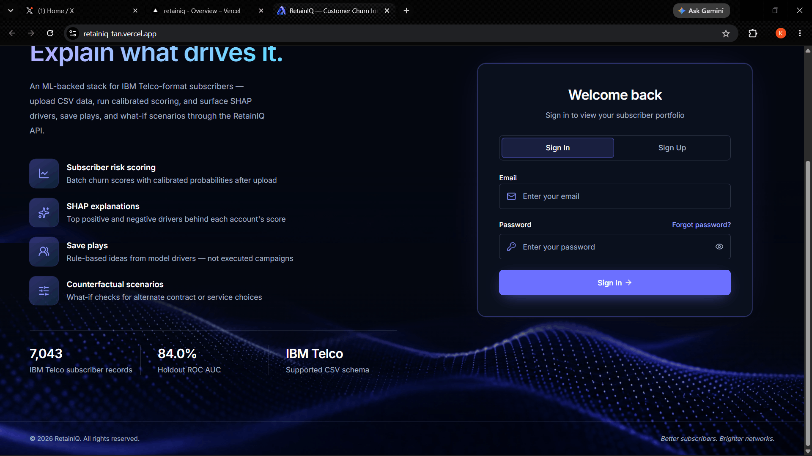

### Upload data

Download the sample CSV, set the decision threshold, and upload a cohort.

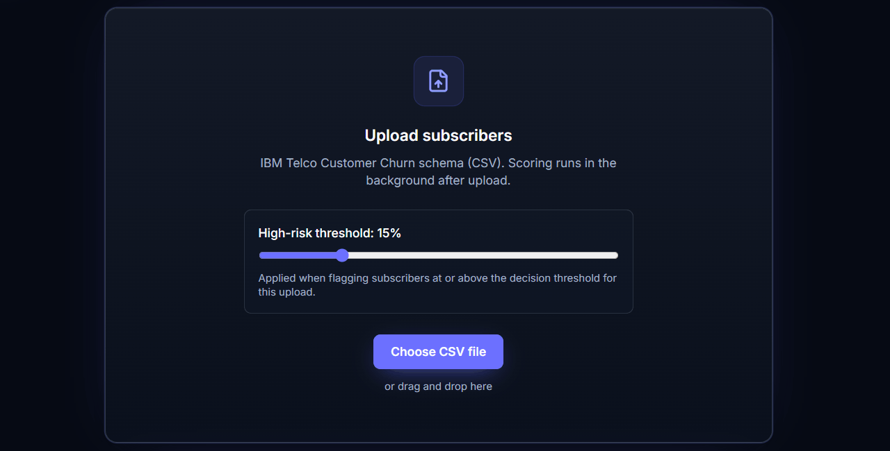

### Dashboard

Sidebar navigation, cohort KPIs, churn distribution, and risk by contract type.

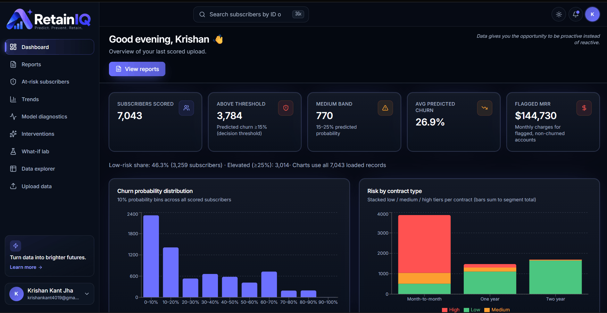

### At-risk subscribers

Filterable list of accounts at or above the decision threshold, with CSV export.

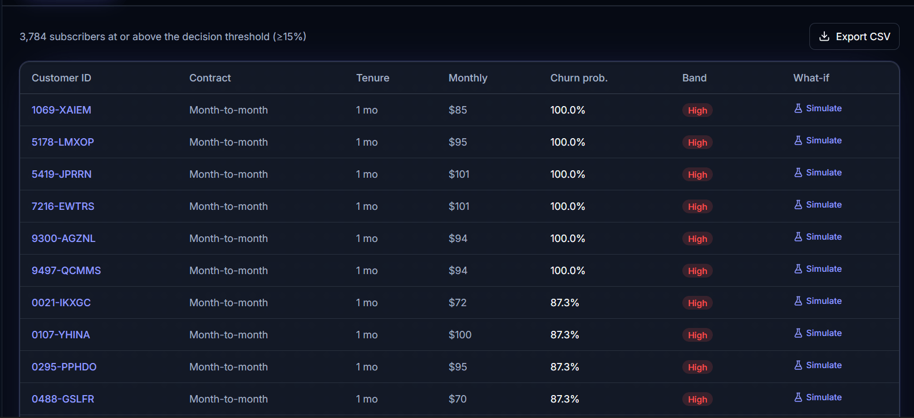

### Trends

Persona clusters, scoring batches, and contract × tenure heatmap.

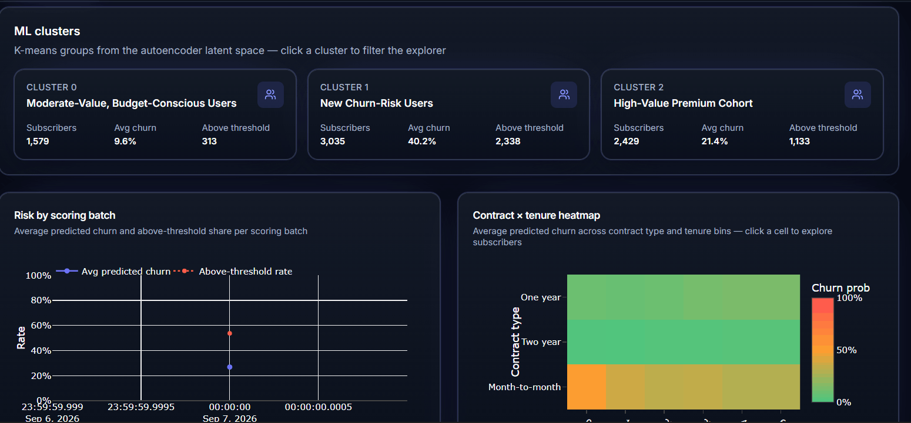

### Reports

Executive summary metrics and charts; export as PDF or CSV.

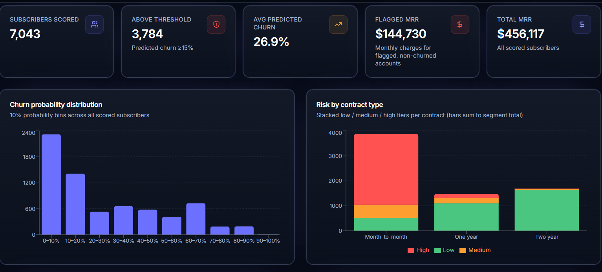

### Model diagnostics

Artifact verification and frozen holdout metrics from training.

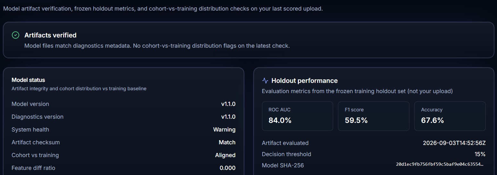

---

## How it is built

### Application architecture

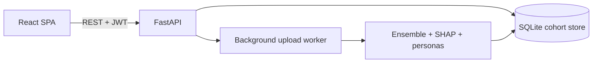
```mermaid
graph LR
    Browser[React SPA] -->|REST + JWT| API[FastAPI]
    API --> Worker[Background upload worker]
    API --> DB[(SQLite cohort store)]
    Worker --> ML[Ensemble + SHAP + personas]
    ML --> DB
```

- **Frontend:** React 19, Vite 7, Tailwind, Recharts, Plotly, jsPDF
- **Backend:** FastAPI, SQLAlchemy, Alembic, JWT auth
- **Database:** SQLite by default (`DATABASE_URL`); PostgreSQL works if you change the connection string
- **ML:** scikit-learn ensemble (XGBoost, LightGBM, GBDT, Logistic Regression), isotonic calibration, local SHAP, K-Means personas
- **Deploy:** Vercel + Render for the hosted instance; Docker Compose optional for local all-in-one runs

Each user only sees their own uploads and scored cohorts. On boot, the API checks ML artifact SHA-256 hashes from `ml/artifacts/artifacts_manifest.json` and refuses to start if files are missing or changed.

### Upload lifecycle

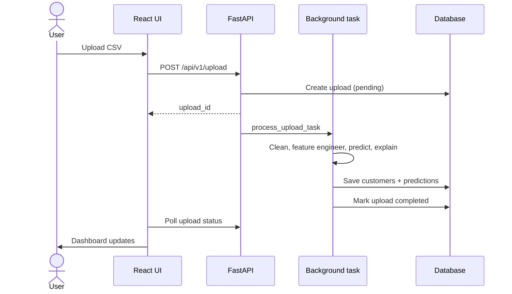
```mermaid
sequenceDiagram
    actor User
    participant UI as React UI
    participant API as FastAPI
    participant Worker as Background task
    participant DB as Database

    User->>UI: Upload CSV
    UI->>API: POST /api/v1/upload
    API->>DB: Create upload (pending)
    API-->>UI: upload_id
    API->>Worker: process_upload_task
    Worker->>Worker: Clean, feature engineer, predict, explain
    Worker->>DB: Save customers + predictions
    Worker->>DB: Mark upload completed
    UI->>API: Poll upload status
    UI->>User: Dashboard updates
```

### Machine learning pipeline

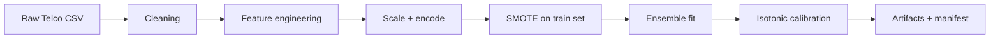
```mermaid
flowchart LR
    A[Raw Telco CSV] --> B[Cleaning]
    B --> C[Feature engineering]
    C --> D[Scale + encode]
    D --> E[SMOTE on train set]
    E --> F[Ensemble fit]
    F --> G[Isotonic calibration]
    G --> H[Artifacts + manifest]
```

| Step | Module | Purpose |
|------|--------|---------|
| Cleaning | `ml/preprocessing/clean.py` | Whitespace, blanks, type casts |
| Features | `ml/preprocessing/engineer.py` | Commitment scores, add-on counts, tenure bins |
| Pipeline | `ml/preprocessing/pipeline.py` | `StandardScaler`, one-hot encoding |
| Imbalance | `ml/preprocessing/imbalance.py` | SMOTE on training data only |
| Training | `ml/training/ensemble.py` | Soft-voting ensemble |
| Calibration | `ml/training/calibration.py` | Reliable probability estimates |
| Explainability | `ml/explainability/shap_local.py` | Per-subscriber drivers and simulations |
| Segmentation | `ml/segmentation/kmeans.py` | Behavioral personas |

Training uses **SMOTE** on the training split (~26.5% churn baseline in the dataset). All reported metrics come from the **natural, un-resampled holdout test set**.

### From score to dashboard view

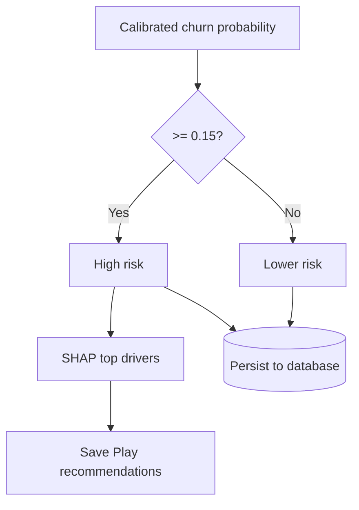
```mermaid
flowchart TD
    P[Calibrated churn probability] --> T{>= 0.15?}
    T -->|Yes| HR[High risk]
    T -->|No| LR[Lower risk]
    HR --> SHAP[SHAP top drivers]
    SHAP --> SP[Save Play recommendations]
    HR --> DB[(Persist to database)]
    LR --> DB
```

The app uses a decision threshold of **0.15**, picked from a simple cost exercise on the holdout set: treat a missed churner as **$5** and a false-positive outreach as **$1**. That favors catching more churners over maximizing accuracy alone. The dollar amounts are illustrative — they are not tied to real telecom pricing.

More on features: **[docs/feature_engineering.md](docs/feature_engineering.md)**

---

## Results

All numbers below come from the **holdout test split** on the IBM Telco dataset. They show how the model behaves in evaluation — not results from a live business deployment.

### Simulated business impact (holdout)

| Metric | No outreach | Standard threshold (0.528) | Cost-optimal threshold (0.15) |
|--------|:-----------:|:--------------------------:|:-----------------------------:|
| Recall (churners caught) | 0.0% | 48.9% | **89.8%** |
| Accuracy | 73.5% | **80.0%** | 67.6% |
| Total churn cost | $1,870 | $1,046 | **$609** |
| Net savings vs baseline | $0 | $824 | **$1,261 (67.4% reduction)** |

### Model benchmarks (holdout)

| Model | Threshold | Accuracy | ROC-AUC | F1 |
|-------|:---------:|:--------:|:-------:|:--:|
| **Calibrated ensemble (default model)** | 0.15 | 67.6% | **84.4%** | **0.595** |
| Logistic regression | 0.528 | 75.7% | 84.4% | 0.624 |
| AdaBoost | 0.50 | 77.9% | 84.0% | 0.634 |
| Gradient boosting | 0.528 | 78.5% | 84.2% | 0.607 |
| XGBoost | 0.528 | 78.6% | 82.5% | 0.584 |
| LightGBM | 0.528 | 78.7% | 83.3% | 0.576 |
| Random forest | 0.528 | 77.4% | 81.2% | 0.545 |

**Why two thresholds?**

- **0.528 / 0.50 (F1-optimal):** Balances precision and recall. Higher accuracy (~80%) but catches only ~49% of churners.
- **0.15 (cost-optimal on holdout):** What the dashboard uses by default. Lower accuracy on paper, but **~90% recall** and lower simulated cost in the exercise above.

### SMOTE comparison (ensemble, holdout)

| Configuration | Threshold | Accuracy | Precision | Recall | F1 | ROC-AUC |
|---------------|:---------:|:--------:|:---------:|:------:|:--:|:-------:|
| With SMOTE (default model) | 0.15 | 67.6% | 44.5% | **89.8%** | 0.595 | 84.0% |
| Without SMOTE | 0.15 | 69.1% | 45.7% | 88.2% | 0.602 | 84.1% |
| With SMOTE (default model) | 0.50 | **80.1%** | **65.6%** | 52.9% | 0.586 | 84.0% |
| Without SMOTE | 0.50 | 79.7% | 64.7% | 51.9% | 0.576 | 84.1% |

At 0.15, SMOTE adds **+1.6% recall** on the holdout set compared to training without it.

### Evaluation plots

Artifacts live in `ml/artifacts/plots/`:

| Plot | What it shows |
|------|----------------|
| SHAP summary | Global feature importance (contract, charges, fiber, etc.) |
| Calibration curve | Predicted vs actual churn rates |
| Threshold sweep | Business cost by probability cutoff; minimum near 0.15 |
| Confusion matrix | Counts at the 0.15 threshold used in the app |
| ROC / PR curves | Discrimination and precision–recall trade-offs |


---

## Live deployment

Public hosted instance — same codebase as this repository.

| Service | URL |
|---------|-----|
| **Dashboard (frontend)** | https://retainiq-tan.vercel.app |
| **API health check** | https://retainiq-api-zzu9.onrender.com/health |

Sign up with an email, upload the sample Telco CSV, then open **At-risk subscribers** or the **Dashboard**.

**Heads up:** the hosted backend uses SQLite on Render's free tier. Uploaded data can be **wiped when the service redeploys**. If the dashboard is empty, sign in and upload the sample CSV again.

OpenAPI docs (`/api/v1/docs`) work when you run the API locally. They are disabled on the public deployment.

Hosting details: **[DEPLOYMENT.md](DEPLOYMENT.md)**

---

## Quick start

**You need:** Python 3.10+ (CI runs on 3.11), Node.js 20+, Git.

### Clone and set up

```bash
git clone https://github.com/krishankantjha/RetainIQ.git
cd RetainIQ
cp .env.example .env
```

**Linux / macOS** — optional helper script:

```bash
./scripts/setup.sh
cd backend && alembic upgrade head && cd ..
```

**Windows (PowerShell)** — run the steps by hand:

```powershell
python -m venv venv
.\venv\Scripts\Activate.ps1
pip install -r backend\requirements-dev.txt
cd backend; alembic upgrade head; cd ..
cd frontend; npm install; cd ..
```

**GitHub Codespaces / Dev Container** — open the repo in a dev container (`.devcontainer/`). Dependencies install on first open; ports 5173 and 8000 forward automatically.

### Run locally

**Backend** (from `backend/`):

```bash
uvicorn app.main:app --reload
```

**Frontend** (from `frontend/`):

```bash
npm install
npm run dev
```

| | URL |
|---|-----|
| UI | http://localhost:5173 |
| API docs | http://localhost:8000/docs |

Set `VITE_API_BASE_URL=http://127.0.0.1:8000` in the root `.env` if the frontend cannot reach the API.

**Docker Compose** (nginx + frontend + backend): see **[DEPLOYMENT.md](DEPLOYMENT.md)**.

---

## Sign in and accounts

### Local dev login

When `APP_ENV=development`, you can sign in as:

- **Email / username:** `admin`
- **Password:** `password`

### Guest access

The login page has a **Continue as guest** button. It uses `VITE_GUEST_USERNAME` and `VITE_GUEST_PASSWORD` from `.env` (defaults match the admin account above).

### Sign up

Set `ALLOW_USER_REGISTRATION=true` to allow public registration. Each new account picks a security question and answer at sign-up.

### Forgot password

1. Click **Forgot password?** on the login page.
2. Enter your email — the app loads your security question.
3. Answer it and set a new password.

This uses `GET /auth/security-question/{username}` and `POST /auth/reset-password` (see [API reference](#api-reference)).

### Settings

After sign-in, open **Settings** from the sidebar to change your display name or password.

---

## Environment variables

One `.env` at the repo root feeds the backend, frontend, and Docker. Copy from [`.env.example`](.env.example).

### Core

| Variable | Description | Default |
|----------|-------------|---------|
| `APP_ENV` | `development` or `production` | `development` |
| `APP_NAME` | API title in logs | `RetainIQ API` |
| `API_V1_STR` | API prefix | `/api/v1` |
| `DATABASE_URL` | SQLAlchemy connection string | `sqlite:///./customer_retention.db` |
| `JWT_SECRET` | Signs auth tokens | Required in production |
| `JWT_ALGORITHM` | Token algorithm | `HS256` |
| `ACCESS_TOKEN_EXPIRE_MINUTES` | How long JWTs last | `60` |
| `ADMIN_USERNAME` | Built-in admin account name | `admin` |
| `ADMIN_PASSWORD_HASH` | Bcrypt hash for admin login | Required in production |
| `ALLOW_USER_REGISTRATION` | Allow `/auth/register` | `false` |
| `ALLOWED_ORIGINS` | CORS origins (comma-separated, no spaces) | localhost dev URLs |
| `MAX_UPLOAD_SIZE_MB` | CSV upload size cap | `25` |

### Frontend (browser-exposed)

| Variable | Description | Default |
|----------|-------------|---------|
| `VITE_API_BASE_URL` | Frontend → API base URL | empty in dev (Vite proxy) |
| `VITE_GUEST_USERNAME` | Guest login username | `admin` |
| `VITE_GUEST_PASSWORD` | Guest login password | `password` |

### Docker Compose ports

| Variable | Description | Default |
|----------|-------------|---------|
| `BACKEND_PORT` | Host port for API | `8000` |
| `FRONTEND_PORT` | Host port for built SPA | `8080` |
| `NGINX_PORT` | Host port for nginx | `80` |

---

## Repository structure

```text
RetainIQ/
├── backend/                 # FastAPI API, auth, upload, analytics
│   ├── app/api/             # Route handlers
│   ├── app/services/        # Inference, ingestion, scoping
│   ├── app/database/        # SQLAlchemy models + Alembic
│   └── tests/               # API and integration tests
├── frontend/                # React + Vite SPA
├── ml/                      # Preprocessing, training, explainability
│   ├── preprocessing/
│   ├── training/
│   ├── explainability/
│   ├── segmentation/
│   └── artifacts/           # Models, encoders, plots, manifest
├── configs/                 # YAML model and feature config
├── docker/                  # docker-compose.yml, nginx
├── data/raw/                # Sample Telco CSV
├── tests/                   # Cross-cutting tests (ML, security)
├── scripts/                 # setup.sh, manifest helper
├── .devcontainer/           # GitHub Codespaces / Dev Container
├── .github/workflows/       # CI (pytest + frontend build)
├── render.yaml              # Render blueprint for the API
├── DEPLOYMENT.md
├── docs/feature_engineering.md
└── LICENSE
```

---

## Retrain and ML commands

Run from the repository root:

```bash
# Preprocessing pipeline → pipeline.pkl
python ml/preprocessing/pipeline.py

# K-Means personas → kmeans artifacts
python ml/segmentation/kmeans.py

# Ensemble training → ensemble model artifacts
python ml/training/ensemble.py

# Threshold / cost sweep
python ml/training/threshold.py

# Drift monitoring utilities
python ml/training/model_monitor.py

# Autoencoder (optional segmentation prep)
python ml/segmentation/train_autoencoder.py
```

After retraining, update `ml/artifacts/artifacts_manifest.json` checksums or let the training scripts regenerate them.

---

## API reference

Base path: `/api/v1`  
Auth: `Authorization: Bearer <token>` unless noted.

| Method | Endpoint | Description | Auth |
|--------|----------|-------------|:----:|
| `POST` | `/auth/register` | Create account (with security question) | No |
| `POST` | `/auth/login` | Get JWT (OAuth2 form: `username`, `password`) | No |
| `GET` | `/auth/me` | Current user profile | Yes |
| `PATCH` | `/auth/me` | Update display name | Yes |
| `POST` | `/auth/change-password` | Change password (logged in) | Yes |
| `GET` | `/auth/security-question/{username}` | Get security question for password reset | No |
| `POST` | `/auth/reset-password` | Reset password with security answer | No |
| `POST` | `/upload` | Upload cohort CSV (async) | Yes |
| `GET` | `/uploads` | List recent uploads | Yes |
| `GET` | `/uploads/{id}/status` | Upload processing status | Yes |
| `GET` | `/customers/search` | Autocomplete customer IDs | Yes |
| `GET` | `/customers/{id}/explain` | SHAP + interventions + simulations | Yes |
| `POST` | `/predict/score` | Score single subscriber | Yes |
| `POST` | `/predict/simulate` | What-if probability | Yes |
| `GET` | `/analytics/overview` | Dashboard KPIs | Yes |
| `GET` | `/analytics/cohort-data` | Paginated cohort table | Yes |
| `GET` | `/analytics/personas` | Cluster summaries | Yes |
| `GET` | `/analytics/save-plays` | Intervention aggregates | Yes |
| `GET` | `/analytics/risk-trend` | Risk over time | Yes |
| `GET` | `/analytics/global-drivers` | Cohort SHAP summary | Yes |
| `GET` | `/analytics/segment-matrix` | Contract × tenure matrix | Yes |
| `GET` | `/analytics/model-health` | Drift and health metadata | Yes |
| `GET` | `/analytics/diagnostics-metadata` | Model version and checksums | Yes |
| `GET` | `/health` | Service health | No |

Rate limits apply on login, upload, and explain paths (see `backend/app/core/rate_limiter.py`).

---

## Testing

```bash
python -m pytest
```

**109 tests** cover API flows, upload → predict → explain, auth, artifact integrity, risk bands, drift utilities, and per-user data isolation.

CI (GitHub Actions on `main`): Python tests + `compileall` + frontend build. Tested with Python 3.11 in CI.

---

## Security notes

Built-in safeguards for authentication, data isolation, and artifact integrity.

| Topic | Implementation |
|-------|----------------|
| **Authentication** | JWT + bcrypt; token version bumps on password change |
| **Password reset** | Security question + answer (set at registration) |
| **Data isolation** | Uploads scoped per registered user; admin sees all |
| **Artifact integrity** | SHA-256 manifest check at startup; corrupt models block boot |
| **Rate limiting** | Sliding window on sensitive endpoints |
| **Log redaction** | Regex filter masks credentials and PII in logs |
| **CORS** | Configurable `ALLOWED_ORIGINS`; validated when `APP_ENV=production` |
| **Secrets on deploy** | `JWT_SECRET` and `ADMIN_PASSWORD_HASH` required when `APP_ENV=production` |
| **OpenAPI** | Disabled on the public deployment |
| **Upload processing** | Background worker; size limit via `MAX_UPLOAD_SIZE_MB` |
| **Cascading deletes** | Removing an upload deletes its customers and predictions |

---

## Known limitations

- **Sample-data scope** — trained and evaluated on IBM Telco public data, not connected to live operator systems. Validate independently before operational use.
- **One CSV schema** — IBM Telco format only. Other schemas need new mapping and retraining.
- **Interventions are suggestions** — Save plays are rule-based ideas from model drivers. Nothing is sent to customers or CRM systems.
- **SQLite on free Render** — suitable for lightweight hosting, but uploaded cohort data may not survive a redeploy. Use PostgreSQL for longer-lived deployments (see [DEPLOYMENT.md](DEPLOYMENT.md)).
- **No email verification** — Accounts are email-based, but there is no inbox confirmation flow yet.

---

## Documentation

| Document | Contents |
|----------|----------|
| [DEPLOYMENT.md](DEPLOYMENT.md) | Render, Vercel, Docker Compose, env vars |
| [docs/feature_engineering.md](docs/feature_engineering.md) | Feature design and rationale |
| [ml/artifacts/metrics/kmeans_personas.md](ml/artifacts/metrics/kmeans_personas.md) | Persona cluster definitions |

---

## Author

Built by **Krishan Kant Jha** — full-stack churn analytics dashboard with ML scoring, SHAP explainability, and an interactive UI on public telecom sample data.

- GitHub: [@krishankantjha](https://github.com/krishankantjha)
- Repo: [RetainIQ](https://github.com/krishankantjha/RetainIQ)
- Live app: [retainiq-tan.vercel.app](https://retainiq-tan.vercel.app)

Questions or feedback? Open an issue on GitHub.

---

## License

MIT — see [LICENSE](LICENSE).
